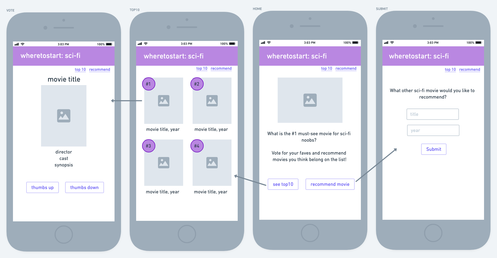
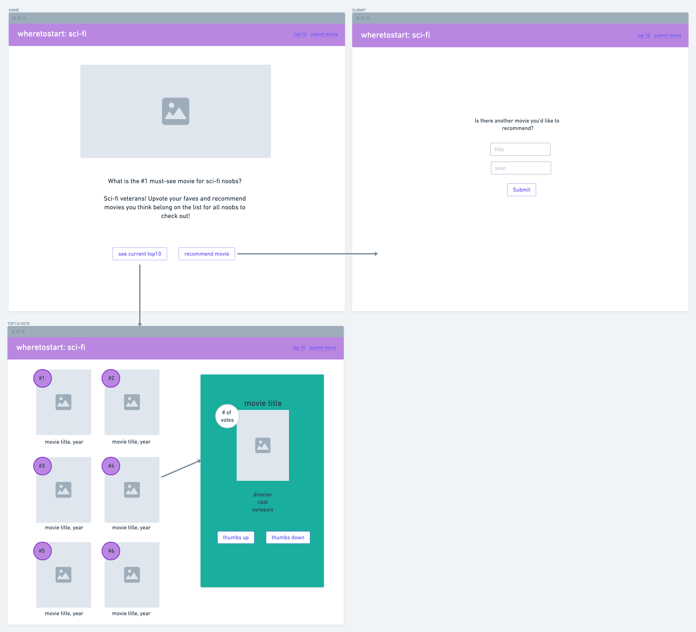
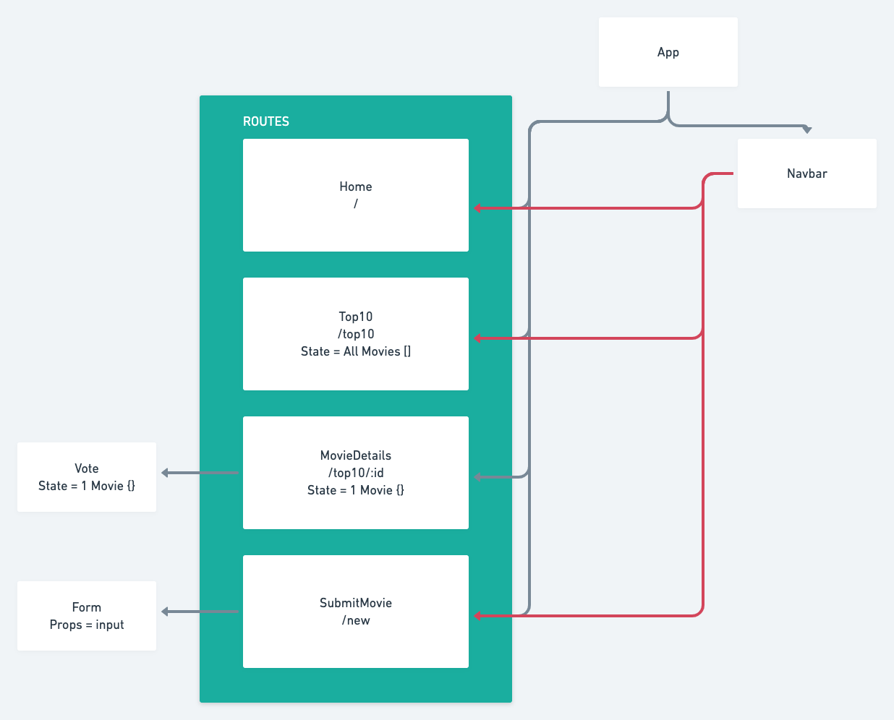

# wheretostart


## Project Description

wheretostart is a collection of resources and recommendations for beginners who are looking to break into a new movie genre, skill, or hobby. This version focuses on sci-fi movies, and users can recommend must-see movies for sci-fi beginners. There is a ranking system based on votes, so that the movies with the most votes gets pushed to the top, and users can also submit new movie recommendations as well.

## Wireframes
The following wireframes depict the mobile and desktop layouts for the app.





## Component Hierarchy



## API and Data Sample


Airtable is returning the data for this base as follows:

```
    {
      "fields": {
        "title": "The Fifth Element",
        "year": "1997",
        "cast": "Bruce Willis, Milla Jovovich, Gary Oldman",
        "plot": "In the colorful future, a cab driver unwittingly becomes the central figure in the search for a legendary cosmic weapon to keep Evil and Mr. Zorg at b...",
        "votes": 0,
        "poster": "https://m.media-amazon.com/images/M/MV5BZWFjYmZmZGQtYzg4YS00ZGE5LTgwYzAtZmQwZjQ2NDliMGVmXkEyXkFqcGdeQXVyNTUyMzE4Mzg@._V1_SX300.jpg",
        "director": "Luc Besson"
      }
    }


```

### MVP/PostMVP

#### MVP

- Display current top 10 recommended movies from Airtable API
- Click on a movie to retrieve more movie details
- Vote thumbs up or thumbs down on a movie and update top 10 rankings
- Form to submit new movie recommendation, retrieve movie's data from OMDB API, and post to Airtable API.
- Utilize React Router to link and display components
- Style using flexbox and include responsive design

#### PostMVP

- Create a section for each movie where users can leave a review
- Create a carousel component so users can click through each movie in the top 10
- Create a section for another category (other movie genre, video games, coding, etc...)

## Project Schedule

| Day     | Deliverable                                | Status   |
| ------- | ------------------------------------------ | -------- |
| Sept 17 | Approval / Airtable Setup / Create Routes  | Complete |
| Sept 18 | Create MVP Components                      | Complete |
| Sept 19 | Complete MVP Components / Basic Styling    | Complete |
| Sept 20 | Complete CSS Components                    | Complete |
| Sept 21 | Post MVP: Review Component                 | Complete |
| Sept 22 | Continue Post MVP / Advanced Styling       | Complete |
| Sept 23 | Post MVP: Add Category / Clean up code     | incomplete |
| Sept 24 | Presentation                               | incomplete |

## Timeframes

| Component                 | Priority | Estimated Time | Time Invested | Actual Time |
| ------------------------- | :------: | :------------: | :-----------: | :---------: |
| Proposal                  |    H     |      2hrs      |      2hrs     |         |
| Airtable setup            |    H     |      1hr       |      2hrs     |          |
| Set up Routes/Components  |    H     |      2hr       |      1hr      |          |
| Set up/test all API calls |    H     |      3hrs      |      2hrs     |         |
| Create top10 component    |    H     |      3hrs      |      3hrs     |         |
| Create details component  |    H     |      3hr       |      2hrs     |         |
| Create submit component   |    H     |      3hrs      |      2hrs     |         |
| Create vote component     |    H     |      3hrs      |      3hrs     |         |
| Structure/Basic styling   |    H     |      3hrs      |      2hrs     |         |
| CSS Components            |    H     |      3hrs      |            |          |
| Create Review Component   |    M     |      5hrs      |      5hrs     |         |
| Edit/Delete Reviews       |    L     |      5hrs      |      3hrs     |          |
| Style Review Component    |    M     |      3hrs      |      2hrs     |          |
| Advanced CSS              |    L     |      3hrs      |            |          |
| Add Add Category          |    L     |      3hrs      |            |          |
| Total                     |    H     |      47hrs     |          |        |

## SWOT Analysis

### Strengths:


### Weaknesses:


### Opportunities:


### Threats:

